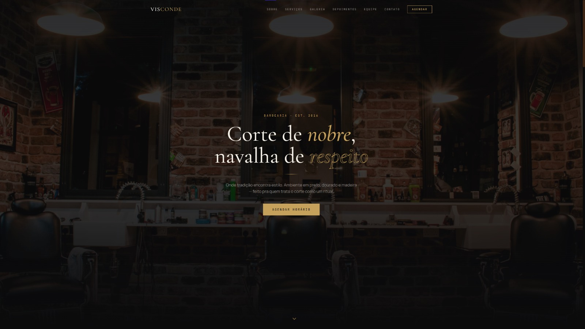

# 💈 Visconde Barber



<p align="center">
  <strong>Uma experiência premium para uma barbearia moderna.</strong>
</p>

<p align="center">
  Landing page institucional desenvolvida para uma barbearia de alto padrão, unindo design sofisticado, responsividade e uma experiência de usuário moderna.
</p>

<p align="center">
  <a href="#-sobre-o-projeto">Sobre</a> •
  <a href="#-funcionalidades">Funcionalidades</a> •
  <a href="#-tecnologias">Tecnologias</a> •
  <a href="#-instalação">Instalação</a>
</p>

---

# 📌 Sobre o Projeto

O **Visconde Barber** é um website institucional fictício desenvolvido para representar uma barbearia premium, com foco em identidade visual elegante, experiência do usuário e apresentação profissional dos serviços.

O projeto foi criado simulando uma solução real para um negócio local, demonstrando como uma presença digital moderna pode fortalecer uma marca, melhorar a comunicação com clientes e gerar uma experiência online diferenciada.

A proposta foi desenvolver uma interface com aparência comercial, seguindo padrões utilizados em projetos profissionais para empresas e negócios.

---

# ✨ Funcionalidades

## 🏠 Landing Page

- Hero section com apresentação da marca
- Chamadas para ação
- Navegação fluida
- Design premium
- Layout responsivo
- Animações e transições suaves

---

## ✂ Serviços

Apresentação dos principais serviços:

- Corte masculino
- Barba tradicional
- Corte + barba
- Tratamentos capilares
- Serviços personalizados

---

## 👔 Sobre a Barbearia

Área dedicada à apresentação da marca:

- História
- Valores
- Diferenciais
- Experiência dos profissionais

---

## 🖼 Galeria

Seção visual para apresentar:

- Ambiente da barbearia
- Estilo da marca
- Experiência oferecida aos clientes

---

## ⭐ Depoimentos

Área de prova social contendo:

- Avaliações de clientes
- Feedbacks
- Experiência dos usuários

---

## 📍 Contato

Informações para facilitar a conversão:

- Localização
- Horário de funcionamento
- Redes sociais
- Botão de contato via WhatsApp

---

# 📱 Responsividade

O projeto foi desenvolvido pensando em diferentes dispositivos:

✅ Desktop  
✅ Notebook  
✅ Tablet  
✅ Smartphone

---

# 🛠 Tecnologias Utilizadas

| Tecnologia    | Utilização                   |
| ------------- | ---------------------------- |
| React         | Construção da interface      |
| TypeScript    | Tipagem estática e segurança |
| Vite          | Ambiente de desenvolvimento  |
| Tailwind CSS  | Estilização moderna          |
| Framer Motion | Animações e interações       |
| Lucide React  | Ícones da interface          |

---

# 🎨 Design

A identidade visual foi inspirada em barbearias premium, utilizando:

- Tons escuros e sofisticados
- Tipografia elegante
- Espaçamento moderno
- Microinterações
- Interface minimalista

A proposta visual transmite:

> Exclusividade, tradição e profissionalismo.

---

# 🚀 Como executar o projeto

## Pré-requisitos

Tenha instalado:

- Node.js
- npm ou yarn

---

## Clone o repositório

```bash
git clone https://github.com/devbyenzo/visconde-barber.git
```

## Acesse a pasta

```bash
cd visconde-barber
```

## Instale as dependências

```bash
npm install
```

## Execute o projeto

```bash
npm run dev
```

O projeto estará disponível em:

```bash
http://localhost:5173
```

---

# 📂 Estrutura do Projeto

```bash
src
│
├── assets
│
├── components
│
├── sections
│
├── pages
│
├── hooks
│
├── data
│
├── App.tsx
│
└── main.tsx
```

---

# 📈 Melhorias Futuras

- [ ] Sistema real de agendamento
- [ ] Integração com WhatsApp Business API
- [ ] Painel administrativo
- [ ] Gerenciamento de serviços
- [ ] CMS para atualização de conteúdo
- [ ] SEO avançado
- [ ] Integração com Google Maps
- [ ] Sistema de avaliações reais

---

# 🌐 Deploy

Projeto hospedado na Vercel:

🔗 https://visconde-barber.vercel.app

---

# 👨‍💻 Autor

Desenvolvido por:

## Enzo Pietrantonio

Full Stack Developer

---

# 📬 Contato

GitHub:
https://github.com/devbyenzo

LinkedIn:
https://linkedin.com

---

<p align="center">
  Desenvolvido com ❤️ utilizando React, TypeScript e Tailwind CSS.
</p>
